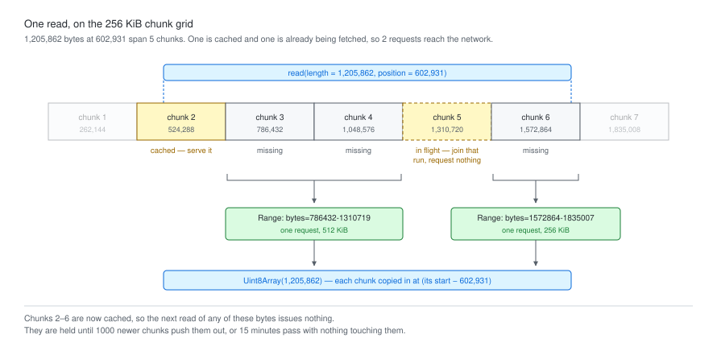

# @gmod/range-cache-filehandle

[](https://npmjs.org/package/@gmod/range-cache-filehandle)


A `GenericFilehandle` that caches byte ranges in chunks and coalesces adjacent
reads into one request.

An indexed genomics parser reads in a pattern the network is bad at: many small,
adjacent, semi-random ranges, most of them near ones it just read. This layer
sits under the parser and turns that into a few large requests, then serves the
next query's overlapping reads from memory.

```sh
npm install @gmod/range-cache-filehandle
```

## Usage

Drop-in for `RemoteFile` from
[generic-filehandle2](https://github.com/GMOD/generic-filehandle2):

```js
import { RemoteFileWithRangeCache } from '@gmod/range-cache-filehandle'
import { CramFile } from '@gmod/cram'

const cram = new CramFile({
  filehandle: new RemoteFileWithRangeCache('https://example.com/file.cram'),
})
```

A local file or `Blob` can be wrapped instead. The second argument keys this
file's chunks in the shared cache, so it must identify the underlying bytes:

```js
import { CachedFilehandle } from '@gmod/range-cache-filehandle'
import { LocalFile } from 'generic-filehandle2'

const file = new CachedFilehandle(new LocalFile(path), `file://${path}`)
```

## What it does



The picture is generated by running the cache — the range headers in it are the
ones that read sent. [CONTRIBUTING.md](CONTRIBUTING.md#docs) says how.

- Serves reads from a 256 KiB chunk grid. The chunks a read is missing are
  grouped into contiguous runs, one request each.
- Joins a chunk another read has in flight rather than requesting it again.
- Reference-counts each run's readers, so a shared request is cancelled only
  once all of them abort. A reader passing no signal pins it for everyone.
- Holds 1000 chunks (256 MB) per worker, swept after 15 minutes idle, 20
  requests at a time **per origin**. `clearCache()` drops everything,
  `clearCacheFor(key)` drops one file, `sweepIdleCache()` reclaims early.
- Clamps reads past EOF once a size is known, from `Content-Range`, a 416, or
  `stat()`.
- Checks a `206` against what it claims to be, so a truncated body or a proxy
  answering with the wrong range fails loudly instead of being cached as a file
  that ends early.
- Names a cause on failure: CORS, mixed content, a server ignoring the Range
  header, a connection that goes 30s without answering.

Nothing is retried, and **nothing puts a clock on a transfer**. This layer
coalesces a run of chunks into one request, so a large one is the normal case,
and any duration limit would cut off a slow download rather than a broken one —
`fetch` [has no timeout of its own](https://github.com/whatwg/fetch/issues/951)
for the same reason. The way to stop a read is the `AbortSignal` you passed it,
which is carried to the socket.

Requests are capped per origin rather than per process so that one unresponsive
server cannot starve the others — the
[per-endpoint semaphore](https://copdips.com/2023/01/python-aiohttp-rate-limit.html)
shape, since a global limit "will unnecessarily restrict requests to other
endpoints as well". Per origin and not per URL, because a presigned URL rotates
its signature on every read and a pool keyed on that would be new every time.

[docs/dataflow.md](docs/dataflow.md) has the diagram and walks one read through
all of it.

## Tuning

`CHUNK_SIZE`, `MAX_CACHE_ENTRIES`, `CACHE_IDLE_TIMEOUT_MS`, `MAX_CONCURRENT` and
`RESPONSE_TIMEOUT_MS` are exported for reading, not setting — the cache is
module-global, so a knob on one filehandle would set policy for every other one
in the process. What each was measured against is in `src/constants.ts` and in
[docs/tuning.md](docs/tuning.md).

## Docs

- [docs/api.md](docs/api.md) — every export, and the `recordSize` hook a
  subclass with its own `stat()` needs
- [docs/dataflow.md](docs/dataflow.md) — how a read flows, with the diagram
- [docs/sharing.md](docs/sharing.md) — one request, several readers, and whose
  abort cancels it
- [docs/tuning.md](docs/tuning.md) — the five constants, what measured them, and
  what changes outside a browser
- [docs/errors.md](docs/errors.md) — what each failure says and why

## References

- [RFC 9110](https://www.rfc-editor.org/rfc/rfc9110.html) — HTTP semantics:
  [Range](https://www.rfc-editor.org/rfc/rfc9110.html#section-14.2) §14.2,
  [Content-Range](https://www.rfc-editor.org/rfc/rfc9110.html#section-14.4)
  §14.4, [206](https://www.rfc-editor.org/rfc/rfc9110.html#section-15.3.7)
  §15.3.7, [416](https://www.rfc-editor.org/rfc/rfc9110.html#section-15.5.17)
  §15.5.17. Only single-part ranges are cached; a multi-range request is passed
  straight through rather than partly honored.
- [WHATWG DOM: dependent signals](https://dom.spec.whatwg.org/#abortsignal-dependent-signals)
  — why `AbortSignal.any` retains nothing while a hand-composed listener must be
  removed.
- [whatwg/fetch#951](https://github.com/whatwg/fetch/issues/951) — why `fetch`
  has no timeout, and why this package adds none over a transfer.
- [Per-endpoint rate limiting](https://copdips.com/2023/01/python-aiohttp-rate-limit.html)
  — the semaphore-per-endpoint shape `MAX_CONCURRENT` uses.

## The layer above

This caches bytes. Every parser that reads through it caches what it parsed out
of them, on its own budget and its own idle timeout, and that cache is the one
that decides whether a read reaches this layer at all:

- [@gmod/bam](https://github.com/GMOD/bam-js) —
  [caching.md](https://github.com/GMOD/bam-js/blob/main/docs/caching.md)
- [@gmod/cram](https://github.com/GMOD/cram-js) —
  [memory.md](https://github.com/GMOD/cram-js/blob/main/docs/memory.md)
- [@gmod/tabix](https://github.com/GMOD/tabix-js) —
  [caching.md](https://github.com/GMOD/tabix-js/blob/main/docs/caching.md)
- [@gmod/bbi](https://github.com/GMOD/bbi-js) —
  [concurrency.md](https://github.com/GMOD/bbi-js/blob/main/docs/concurrency.md)

## Provenance

Extracted from JBrowse 2, where it was
`@jbrowse/core/util/io/RemoteFileWithRangeCache`, so parsers can use it without
depending on `@jbrowse/core`.

Replaces [http-range-fetcher](https://github.com/rbuels/http-range-fetcher), the
earlier inspiration. That merges the requests made in the last 100 ms; this
merges the chunks a read is missing, so it needs no window to wait out and
carries an `AbortSignal` to the socket.

## License

MIT
