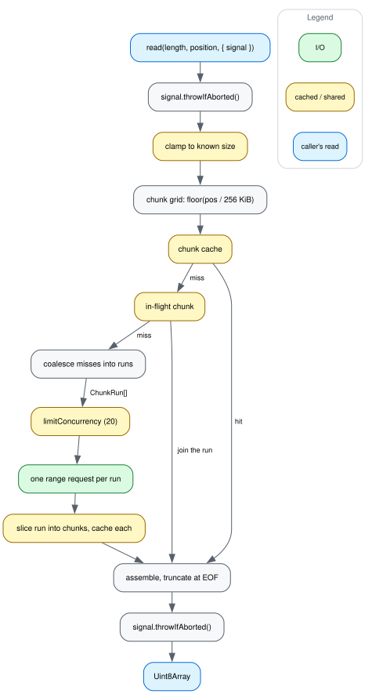

# How a read flows

[dataflow.dot](img/dataflow.dot) is the source; see
[CONTRIBUTING.md](../CONTRIBUTING.md) for how to re-render it.

A read arrives as `(length, position)` — a parser asking for the bytes of a BAM
index bin or a BGZF block. It does not become a request for those bytes. The
layer snaps the range to a 256 KiB grid, resolves each chunk of the grid
separately, and only the chunks nothing has yet reach the network. So a query's
read pattern — many small, adjacent, semi-random ranges — turns into a few large
requests, and a second query over the same region turns into none.

The four steps of that, in order.

## Clamping

`getCachedRange` starts by cutting the requested range down to the file size,
when the size is known.

That is not a tidiness measure. `@gmod/bam` and `@gmod/tabix` compute the end of
their last read as `maxv.blockPosition + (1 << 16)` so the final BGZF block is
read whole, which by construction runs past EOF on the last block of every file.
Unclamped, that tail asks for chunks that start past the end of the file, and
the server answers 416.

The size arrives from any of three places: a `Content-Range` header on a 206, a
`Content-Range` on a 416, or a `stat()`. Whichever comes first fills the size
cache, which is keyed like the chunk cache rather than held on the filehandle —
a cache hit serving bytes some earlier instance fetched would otherwise leave a
new instance with nothing to clamp against. `CachedFilehandle.stat()` records
the size it gets from the local file or Blob for the same reason.

When no size is known at all — a cross-origin server that does not expose
`Content-Range` — a second mechanism covers the same case: a cached chunk
shorter than 256 KiB is where the file ended, so planning stops there.

## Planning

Each chunk index in the range resolves to one of three things, and the walk
happens in a single synchronous pass with no `await` in it, so two reads landing
in the same tick cannot both open a request for the same chunk.

- **Cached.** Serve the bytes, and move the entry to the end of the map's
  iteration order — eviction takes from the front, so this is what makes the LRU
  an LRU rather than FIFO by first fetch.
- **In flight.** Await the promise another read already has for it, and register
  this reader's interest in the run that promise belongs to.
  [sharing.md](sharing.md) is that mechanism.
- **Missing.** Extend the current run of contiguous missing chunks, or open a
  new one.

The runs are what get fetched: one range request each, covering every chunk in
the run. A single 4 kb viewport over a 2000x BAM measured at 6.5 MiB in one
request this way.

## Fetching

Each run goes through `limitConcurrency` — at most 20 requests in flight for any
one file, the rest queued — and then to the underlying source, which is the only
part of this package that knows what the source is. `RemoteFileWithRangeCache`
sets a range header and calls `fetch`; `CachedFilehandle` calls `read` on
whatever it wraps.

The response is sliced into chunk-sized pieces with `slice`, not `subarray`. A
view would keep the whole 6.5 MiB run buffer alive for as long as any one of its
chunks stayed cached, so evicting a chunk would free nothing and
`MAX_CACHE_ENTRIES` would bound nothing. Copying is what makes the entry count a
real memory bound. A run that crossed EOF comes back short, and the short chunk
is cached as-is so a later read finds the EOF marker instead of asking again.

## Assembling

Every chunk the read will use is copied into the result buffer at an offset
computed from absolute file positions, so a short chunk cannot shift where later
chunks land. The read holds its own references to those chunks from before its
first `await`, which is what makes eviction underneath it harmless: the global
cache is shared and capped, so a concurrent read's `putCached` can drop a chunk
this read still needs, and the local reference means it never notices.

The last thing before returning is a second `throwIfAborted`. The bytes may have
arrived after this particular reader gave up — the request kept going because
somebody else still wanted it — and cancellation is per-reader even though the
fetch is not.

## Where the two entry points differ

`RemoteFileWithRangeCache.read` bypasses `RemoteFile.read` entirely rather than
overriding it lower down, because that method builds a range header, calls
`fetch`, and unwraps a `Response` — three copies of the whole range, with no
network to hide behind on a cache hit. Measured warm, that round trip was 69-77%
of the read (6.15ms vs 1.90ms at 16MB).

The `fetch` override still caches, so a caller that sets its own range header
enters the same cache one layer lower. A `Request` object rather than a string
URL is passed straight through: it has no stable cache key, since
`String(request)` is `[object Request]` for every request there is.

Whole-file `readFile` skips the cache in both classes. It is one pass over bytes
the caller is about to hold in full anyway, so chunking it would double the peak
for no reuse.

## What is not here

Nothing is retried. A failed range read surfaces as an error and the reader
decides — what it says and how it decides is [errors.md](errors.md).

There is no per-byte progress. Range reads return a fully-assembled in-memory
`Response`, so `generic-filehandle2`'s streaming `onProgress` sees the whole
buffer at once and reports 0→100 instantly. The indexed parsers self-report at
block granularity from their index metadata, which is the meaningful unit and
also reflects cache hits.
